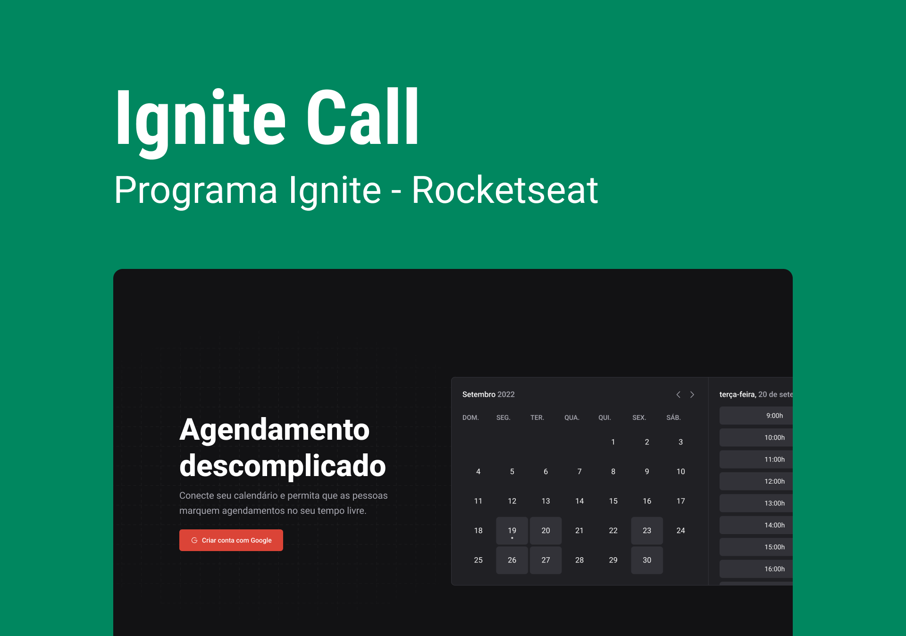

<h1 align="center">
  Ignite Call
</h1>
<p align="center" margin-top="25px" >
  
</p>
 

## 💻 About

Aplicativo de agendamento rápido conectado ao google calendário do logado

- [x] Autenticação de rotas em Next.js.
- [x] Autenticação com Next Auth.
- [x] Validação com zod.
- [x] Integração com Google Calendario
- [x] Integração com Design System 
- [x] Marcações SEO

## 🛠 Tech Stack

- [React](https://reactjs.org)
- [Next](https://nextjs.org/)
- [Next-Auth](https://next-auth.js.org/)
- [Next-seo](https://github.com/garmeeh/next-seo)
- [Nookies](https://www.npmjs.com/package/nookies)
- [React-hook-form](https://react-hook-form.com/)
- [Zod](https://github.com/colinhacks/zod)
- [TypeScript](https://www.typescriptlang.org)
- [Stitches](https://stitches.dev/)
- [Phosphor-react](https://phosphoricons.com/)
- [Radix-u](https://www.radix-ui.com/)
- [Axios](https://www.axios.com/)
- [Prisma](https://www.prisma.io/)
- [@ignite-ui/react](https://www.npmjs.com/package/@ignite-ui/docs)
- [React-query](https://react-query-v3.tanstack.com/)
- [Dayjs](https://day.js.org/)
- [Googleapis](https://www.npmjs.com/package/googleapis)
- [Docker](https://hub.docker.com/)
- [Mysql](https://hub.docker.com/_/mysql)
___

## 🔖 Layout 

Acesse o link e veja o design do projeto no figma

- [Layout Web](https://www.figma.com/community/file/1161274296921389678)

___ 

## Web 

https://github.com/RobsonFeitosa/ignite-call/assets/13018367/f917018d-7461-4a7b-88e4-d0764a8f95e8

___ 

## 🚀 Como funciona

### Pre-requisitos
Ferramentas instaladas em sua máquina: [Git] (https://git-scm.com/), [Node.js] (https://nodejs.org/en/). [Docker] (https://docs.docker.com/)

Node: 18

#### 🧭 Executando a aplicação (Frontend)

```bash
# Clone do repositório
$ git clone git@github.com:RobsonFeitosa/ignite-call.git

# Acesso ao projeto pelo terminal
$ cd ignite-call

# Instalando dependências
$ npm install

# Levantando banco
$ docker-compose up -d

# Criando migrações
$ npx prisma migrate dev

# Executando aplicação em desenvolvimento
$ npm run dev

# O aplicativo pode ser acessado pela porta: 3000 - abra a url http://localhost:3000
``` 
